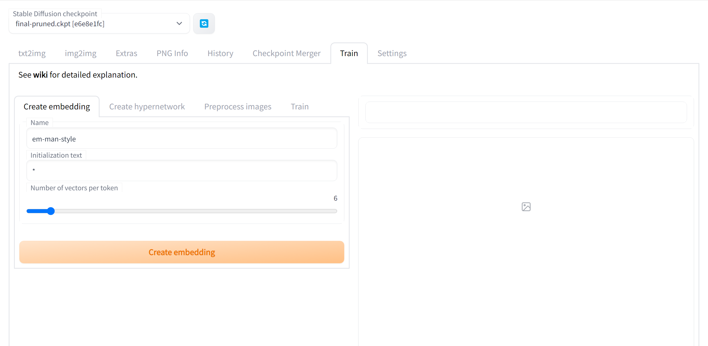
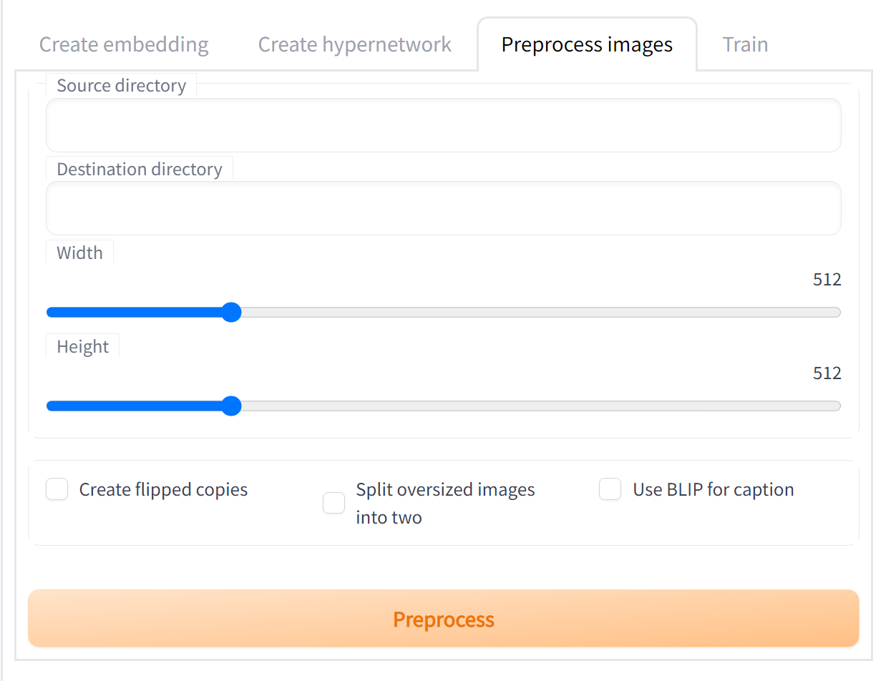
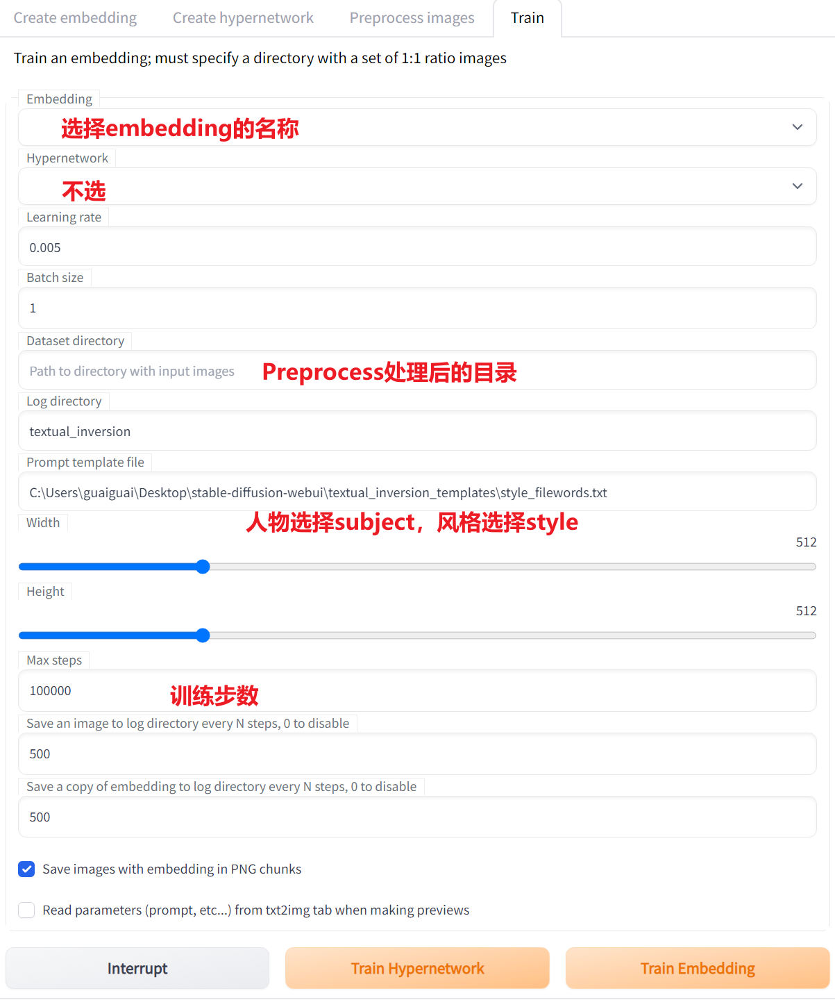

1. 不能使用`eva.pt`模型进行训练，在启动前去到`models/Stable-diffusion`目录中将此文件改名

2. 启动`webui.py`时不能带有`--medvram`参数，否则不能正常创建embedding

3. 准备好图片数据，裁剪成正方形，可以使用[Brime](https://www.birme.net)网站进行辅助。根据GPU算力确定裁剪尺寸，6G显存使用384像素；一般使用512像素。

4. 打开网页，选择Train，选择Creating embedding创建一个embedding。`Name`是embedding的名字，也**是此模型的tag关键词**；`Initialization text`是对模型的描述，比如1girl之类的；`Number of vectors per token`表示生成图片对此tag的接近程度，填6。

   

5. 到Preprocess images中预处理图片；Source填写数据图片的目录；Dest是它的输出目录；将宽和高改为图片的宽高；勾选`Create flipped copies`，即生成镜像文件；不要勾选`Split oversized images into two`，其将高/宽的图片分成2个部分。

   

6.  在Train中开始训练。

   

